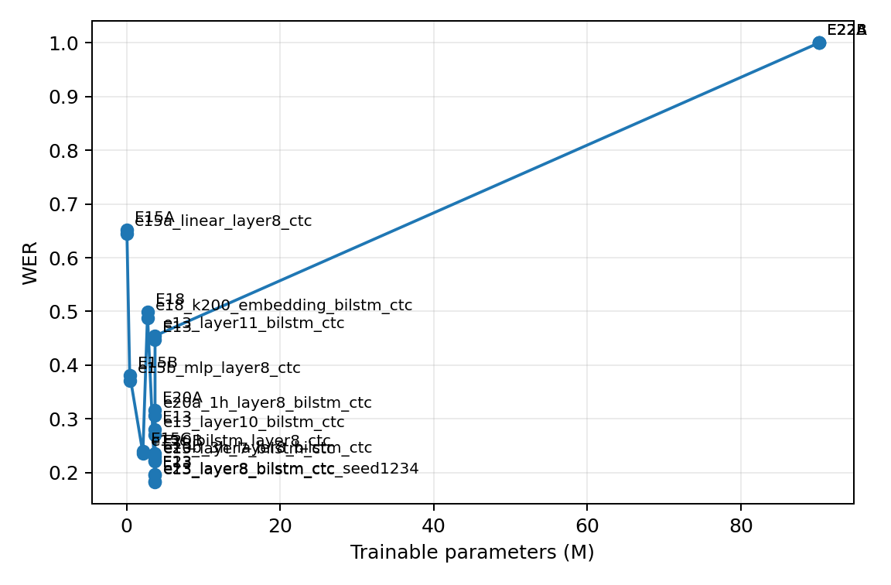
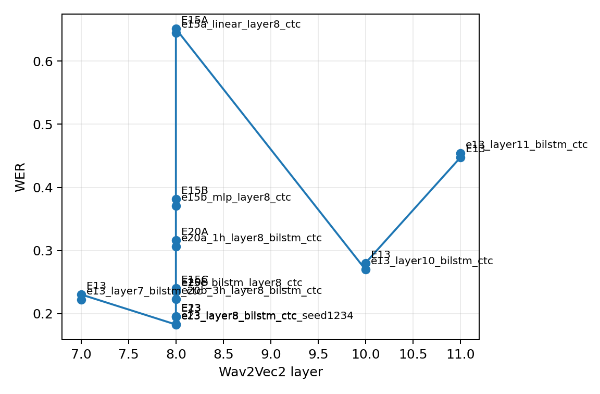
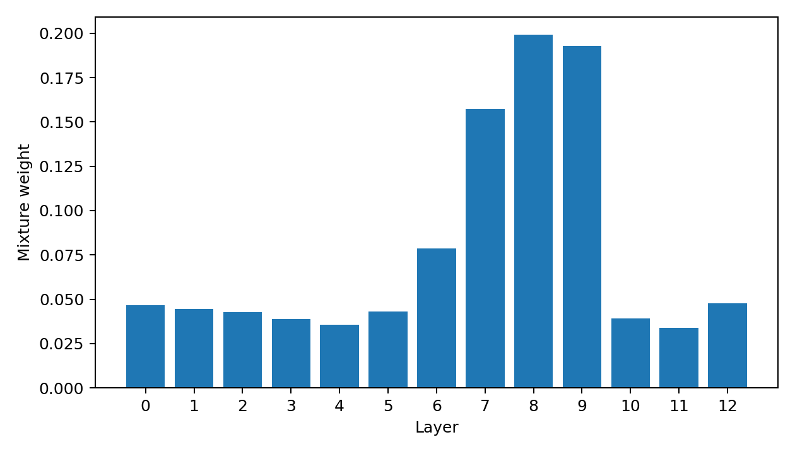
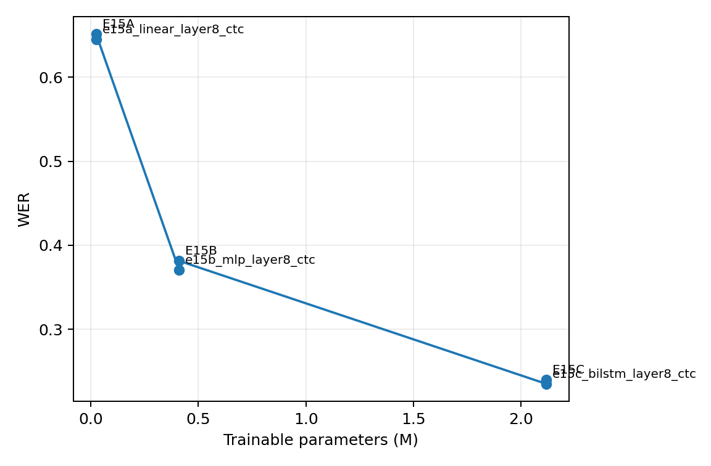
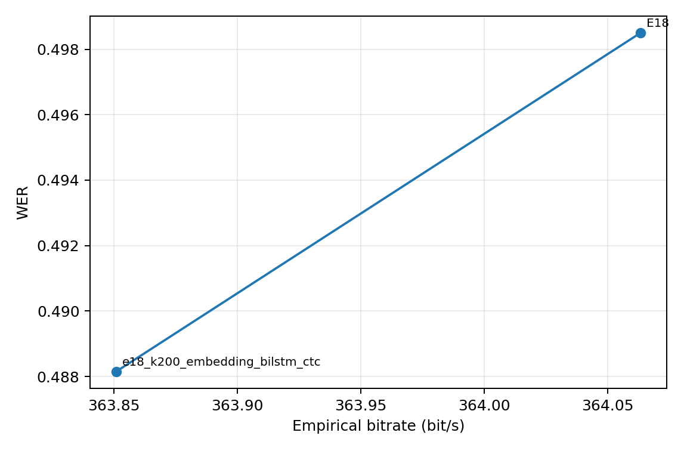
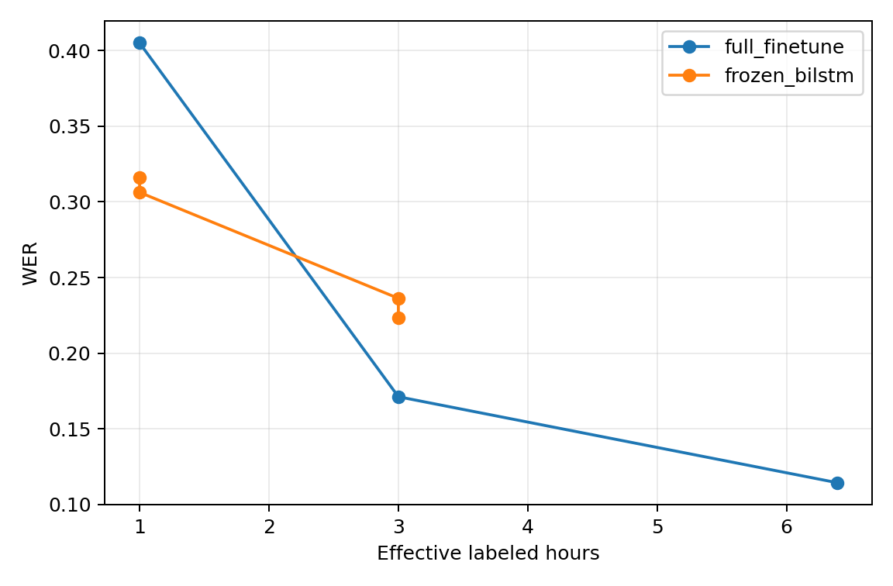
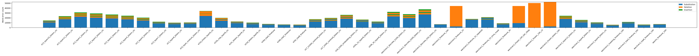

# 低资源 SSL-ASR 全部实验结果综合分析

> 分析范围：`doc/` 中的项目规划与阶段总结，以及 `exp/`、`artifacts/`、
> `logs/`、`results/` 中截至 2026-07-03 的全部可用实验产物。  
> 核心评价集：LibriSpeech `test-clean`，2,620 条、5.403 小时、52,576 词。  
> 指标：WER/CER 越低越好；除特别说明外，表中均为最终 `test-clean` 结果。

---

## 1. 摘要

本项目从“低资源下是否应微调 SSL encoder”逐步扩展到数据规模、参数更新范围、
隐藏层选择、下游 head 容量、连续/离散表示、正则化和稳定性分析。全部结果共同
支持以下结论：

1. **当前最佳点估计是 E8：11.35% WER / 3.34% CER。** 但 E8 与标准全量
   微调 E2（11.44% / 3.36%）仅相差 0.086 个 WER 百分点，已有 10,000 次
   配对 bootstrap 的 95% CI 为 `[-0.313, +0.137]` 个百分点，不能宣称
   feature masking 带来稳定提升。最稳妥的表述是 E2 与 E8 性能相当。
2. **标注数据量是最强影响因素之一。** 全量微调从 1.001h 增至 3.001h，
   WER 从 40.51% 降至 17.12%；继续增至 6.392h 后降至 11.44%，收益仍明显，
   但边际递减。
3. **参数高效微调存在清晰拐点。** 只训练顶部 8 层、约 61.84M 参数时达到
   11.95% WER；顶部 5 层为 12.62%，顶部 4 层为 14.40%。继续减至顶部 3 层
   会明显退化到 22.41%。因此 5–8 个 Transformer 层是当前配置更合理的区间。
4. **冻结表征并非无效，关键在于取层和 head。** 最后一层接 linear CTC 的
   E1 几乎完全失败；而冻结 layer 8、使用两层 BiLSTM-CTC，仅训练 3.695M
   参数即可达到 19.51% WER。失败的是“最后层 + 弱 head”组合，不能据此否定
   frozen SSL representation。
5. **Wav2Vec2 的 ASR 可用信息集中在中高层而非最终层。** 完整 layer-wise
   probing 呈明显倒 U 型，layer 8 最佳（19.51%），layer 9 次之（20.51%）；
   layer 12 退化到 46.18%。
6. **可学习层融合没有超过直接选择最佳层。** E14 的 20.35% WER 弱于单独
   layer 8 的 19.51%；其最大权重也集中在 layer 8、9、7，说明 dev 选层已经
   捕获了主要有效区域。
7. **下游 head 的序列建模能力至关重要。** 固定 layer 8 后，linear、MLP、
   一层 BiLSTM、两层 BiLSTM 的 WER 依次为 65.12%、38.15%、23.98%、
   19.57%，性能随 head 容量和时序建模能力稳定改善。
8. **离散化形成明确的码率—性能权衡，但仍显著损失识别信息。** K 从 50
   增至 1000 时 WER 持续下降；K=1000 达到 33.11%，仍远弱于连续 layer 8
   的 19.51%。较差结果不是 codebook collapse，因为各 codebook 利用率约为
   92.4%–100%。
9. **极低资源下出现策略交叉。** 1h 时 frozen layer 8 + BiLSTM 的 31.63%
   优于 full fine-tuning 的 40.51%；到 3h 和 6.392h 时 full fine-tuning
   反而分别领先 6.50 和 8.08 个百分点。冻结 encoder 在极低资源时更稳，
   数据增多后则限制性能上限。
10. **关键 frozen 配置具有良好种子稳定性。** layer 8 + 两层 BiLSTM 在
    seed 42/1234 下 test WER 分别为 19.515%/19.594%，仅差 0.080 个百分点。

---

## 2. 数据、评测口径与完整性审计

### 2.1 实际数据规模

实验名沿用最初的 1h/3h/10h 命名，但训练入口过滤了超过 15 秒的音频，因此
论文和图表必须报告实际有效时长：

| 名义设置 | 实际有效时长 | 主要实验 |
|---|---:|---|
| 1h | 1.001h | E3、E12、E20A |
| 3h | 3.001h | E5、E20B |
| 10h | 6.392h | E1、E2、E4、E6、E8–E11、E13–E18、E23 |

最终 `test-clean` 评测统一覆盖 2,620 条、5.403 小时。基础阶段检查过的 16 份
test prediction 的 ID、reference、duration 和顺序一致；深挖实验同样均有
2,620 条 test prediction，因此同一批测试结果可以直接横向比较。

### 2.2 结果源的采用优先级

本报告按以下顺序取值：

1. test 结果优先采用 `results/test_metrics.csv`、
   `results/representation_test_metrics.csv`、逐条 test prediction 及
   `results/deep_dive_error_stats.csv`；
2. dev 最优值和参数量采用各 `exp/**/summary.json`；
3. 训练完成状态采用 `completion.json`，训练耗时和失败原因由日志核对；
4. 旧分析文档用于恢复已验证的 bootstrap 区间和已知实现边界，不用旧文档
   覆盖当前原始结果。

### 2.3 当前产物中的不一致

以下问题不会改变 test 主结论，但应在后续汇总脚本中修复：

- `results/metrics.csv` 当前 E2 dev 行仍为含 Trainer padding 伪 apostrophe
  的旧值 15.70% WER；正确清理值为 11.09%。当前
  `wav2vec2_finetune_10h_dev.jsonl` 也再次被旧同步文件覆盖。E2 test 文件不受
  该问题影响，本报告使用其 11.44% test WER。
- `results/deep_dive_metrics.csv` 只包含部分深挖实验，不能单独代表完整结果；
  E13/E14/E15/E16/E17 的缺行由 experiment summary 和逐样本错误统计补齐。
- `results/data_scale_frozen_vs_finetune.csv` 同时保留了 E20 的 dev 和 test
  数值，但没有 split 列，且出现重复标签。本报告分别从 summary/test
  prediction 取值，不使用该文件直接作最终表。
- `artifacts/deep_dive/best_layer_e13.txt` 和 `artifacts/kmeans/best_layer.txt`
  在当前瘦身同步后为空；最佳层应由 dev WER 重新确定为 layer 8。
- E10/E11 缓存训练器使用 32 类输出，其他正式字符 CTC 系统使用 30 类。
  未观察到 `<s>`/`</s>` 被解码，但严格公平复现仍应统一词表。

---

## 3. 基础实验与主系统

| ID | 系统 | 有效数据 | 可训练参数 | WER | CER | 完全正确句 |
|---|---|---:|---:|---:|---:|---:|
| E1 | Frozen Wav2Vec2 + linear CTC | 6.392h | 0.023M | 99.92% | 85.46% | 0 |
| E2 | Full fine-tuned Wav2Vec2 | 6.392h | 90.194M | 11.44% | 3.36% | 597 |
| E3 | Full fine-tuned Wav2Vec2 | 1.001h | 90.194M | 40.51% | 11.65% | 12 |
| E4 | Full fine-tuned WavLM | 6.392h | 90.205M | 17.50% | 5.08% | 291 |
| E5 | Full fine-tuned Wav2Vec2 | 3.001h | 90.194M | 17.12% | 4.88% | 319 |
| E6A | Wav2Vec2 top-6 fine-tuning | 6.392h | 47.667M | 12.14% | 3.42% | 545 |
| E6B | Wav2Vec2 top-3 fine-tuning | 6.392h | 26.403M | 22.41% | 6.03% | 130 |
| E8 | Full fine-tuning + feature masking | 6.392h | 90.194M | **11.35%** | **3.34%** | 608 |
| E9 | Frozen Wav2Vec2 + online BiLSTM | 6.392h | 3.694M | 100.00% | 99.85% | 0 |
| E12A | 1h full fine-tuning + time masking | 1.001h | 90.194M | 40.73% | 11.67% | 22 |

### 3.1 数据规模

全量微调曲线为：

```text
1.001h → 40.51%
3.001h → 17.12%
6.392h → 11.44%
```

1h→3h 的相对 WER 降幅为 57.74%，3h→6.392h 为 33.19%。这说明最初几小时
的新增标注价值最高，但 3h 以后仍未饱和。

### 3.2 Encoder 对比

在相同 6.392h 数据和同类 full fine-tuning 设置下，Wav2Vec2 的 11.44% 明显
优于 WavLM 的 17.50%。该结果说明“更换预训练模型”不会自动带来收益；在当前
字符级 CTC、优化超参数和低资源规模下，Wav2Vec2 更匹配任务。不能把这个单一
配置推广成 Wav2Vec2 普遍优于 WavLM。

### 3.3 Masking

E8 与 E2 的差距不显著。1h 下 E12A 与 E3 的差值为 +0.226 个百分点，
paired-bootstrap 95% CI `[-0.053, +0.502]`，同样不能证明 time masking
稳定改善或退化。正则化差异远小于数据规模、取层和参数更新范围的影响。

---

## 4. 参数高效微调：更新多少层

深挖阶段补齐 E2 与 E6A/E6B 之间的 top-k 网格：

| 系统 | 训练顶部层数 | 可训练参数 | 相对 E2 参数 | Test WER | 相对 E2 |
|---|---:|---:|---:|---:|---:|
| E6B | 3 | 26.403M | 29.27% | 22.41% | +10.97pp |
| E16A | 4 | 33.491M | 37.13% | 14.40% | +2.96pp |
| E16B | 5 | 40.579M | 44.99% | 12.62% | +1.18pp |
| E6A | 6 | 47.667M | 52.85% | 12.14% | +0.70pp |
| E16C | 8 | 61.843M | 68.57% | 11.95% | +0.51pp |
| E2 | 12（除 CNN 外） | 90.194M | 100% | 11.44% | 0 |

结果在 top-3 与 top-4 之间出现最大跃升，在 top-5 后逐渐接近 full
fine-tuning。若目标是性能优先，top-8 是最接近 E2 的参数高效方案；若目标是
训练参数与性能平衡，top-5/top-6 更合理。E6A 相比 E2 的 +0.70pp 已有配对
bootstrap 95% CI `[+0.465, +0.943]`，差距虽小但不是测试集抽样噪声。

日志中的单次训练耗时也与参数减少方向一致：E2 约 78.4 分钟，E6A 44.3 分钟，
E6B 37.1 分钟，E16A/B/C 约 42.5/42.5/44.4 分钟。但各实验最大步数和停止点
并不完全相同，这些数值只能作工程成本参考，不能视为严格速度 benchmark。



---

## 5. 完整隐藏层分析

E13 与已有 E10 合并后覆盖 Wav2Vec2 Transformer layer 1–12。所有系统冻结
encoder，使用同一类两层 BiLSTM-CTC head，并主要使用 seed 42。

| Layer | Dev WER | Test WER |
|---:|---:|---:|
| 1 | 60.22% | 59.67% |
| 2 | 54.99% | 55.57% |
| 3 | 50.84% | 51.11% |
| 4 | 45.95% | 46.48% |
| 5 | 38.58% | 39.09% |
| 6 | 29.01% | 30.03% |
| 7 | 22.18% | 23.03% |
| **8** | **18.26%** | **19.51%** |
| 9 | 19.41% | 20.51% |
| 10 | 26.96% | 28.02% |
| 11 | 45.45% | 44.73% |
| 12 | 47.27% | 46.18% |

信息可用性从浅层到 layer 8 持续增强，随后快速下降。layer 8 与 layer 9 是
稳定的甜点区，最终层并不是最佳通用声学表示。dev 选择 layer 8 后 test 仍最佳，
不存在因 test 调层造成的泄漏。



### 5.1 Learned scalar mixture

E14 对输入投影及 12 个 Transformer 层进行可学习标量融合，test WER 为
20.35%，比单独 layer 8 高 0.83pp。学习权重最高的是 layer 8（19.92%）、
layer 9（19.28%）和 layer 7（15.72%），其余单层均低于 8%。这与 probing
曲线一致，但简单加权会混入较弱层，当前数据量下没有超过硬选择。



### 5.2 第二随机种子

| 配置 | Seed | Dev WER | Test WER | 完全正确句 |
|---|---:|---:|---:|---:|
| Layer 8 + 2-layer BiLSTM | 42 | 18.262% | 19.515% | 226 |
| Layer 8 + 2-layer BiLSTM | 1234 | 18.336% | 19.594% | 240 |

test 仅差 0.080pp，说明“layer 8 是最佳 frozen 层”和该 head 的性能不是单次
随机初始化偶然结果。不过其他 full/partial fine-tuning 与离散实验仍以单 seed
为主。

---

## 6. 下游 head 容量

E15 固定 frozen layer 8，只改变下游 head：

| Head | 可训练参数 | Test WER | Test CER | 完全正确句 |
|---|---:|---:|---:|---:|
| Linear CTC | 0.025M | 65.12% | 23.12% | 0 |
| 2-layer MLP CTC | 0.410M | 38.15% | 10.99% | 28 |
| 1-layer BiLSTM CTC | 2.118M | 23.98% | 7.42% | 125 |
| 2-layer BiLSTM CTC | 3.695M | **19.57%** | **6.13%** | 225 |

Linear→MLP 的改善说明非线性映射重要，MLP→BiLSTM 的进一步大幅改善说明
上下文和时序建模更重要。两层 BiLSTM 与 E13 layer 8 的独立运行几乎一致，
也从侧面验证了结果可复现。

这组实验解释了 E1：冻结 encoder 并不是根本问题，E1 同时选择了不理想的最终层
和过弱的线性 head。E9 虽使用 BiLSTM，但在线训练发生数值塌缩，也不能作为
该架构的正常上限。



---

## 7. 连续表示与离散单元

### 7.1 基础 layer 9 离散实验

| 表示 | K | Test WER | 经验码率 | Dedup 码率 | 利用率 |
|---|---:|---:|---:|---:|---:|
| Continuous FP16 | — | 20.51% | 613,344 bit/s | — | — |
| Centroid units | 50 | 71.56% | 274.93 bit/s | 143.51 bit/s | 100% |
| Centroid units | 100 | 61.65% | 324.43 bit/s | 187.22 bit/s | 99% |
| Centroid units | 200 | 52.60% | 374.31 bit/s | 236.31 bit/s | 100% |

K 增大后 WER 单调下降，但 K=200 仍是连续 layer 9 WER 的 2.56 倍。连续表示
与 K=50/100/200 的理论存储码率相差约 2,231×/1,891×/1,639×，形成非常清楚的
压缩—识别性能权衡。

### 7.2 Layer 8 大 codebook

E17 在 E13 选出的 layer 8 上继续扩大 codebook：

| K | Test WER | Dev 利用率 | Dev perplexity | Dev 经验码率 | Dev Dedup 码率 |
|---:|---:|---:|---:|---:|---:|
| 200 | — | 99.0% | 156.7 | 363.85 bit/s | 212.75 bit/s |
| 500 | 37.88% | 95.2% | 364.7 | 424.66 bit/s | 265.96 bit/s |
| 1000 | **33.11%** | 92.4% | 605.4 | 461.13 bit/s | 291.41 bit/s |

K=500→1000 带来 4.77pp 绝对 WER 改善，说明 K=200 尚未饱和；但 codebook
变大后利用率略降，并且 K=1000 仍比连续 layer 8 差 13.60pp。离散化丢失的是
实质性识别信息，而不是简单的 codebook 未使用。

旧 K=50/100/200 使用 layer 9，新 K=500/1000 使用 layer 8，因此跨两组曲线
可以讨论总体趋势，不能把全部改善严格归因于 K。

### 7.3 Learned embedding

E18 使用 layer 8、K=200 的 unit ID + 256 维 learned embedding，test WER
为 49.85%，可训练参数 2.697M。数值上优于旧 layer 9 centroid K=200 的
52.60%，但两者同时改变了 source layer、输入形式和 head 参数量，**不能据此
断言 learned embedding 优于 centroid**。当前缺少 layer 8、K=200、相同 head
设置的 centroid test 对照，这是 E18 计划中尚未闭合的因果比较。

### 7.4 正确解释 bitrate

这里的 bitrate 是中间表示的理论存储/传输成本，不是端到端语音识别系统码率，
也不代表推理算力。离散系统仍需运行完整 Wav2Vec2 encoder 和 K-means 分配；
若要真正压缩部署模型，还需要离线 token、蒸馏或轻量 acoustic tokenizer。



---

## 8. 数据规模 × 训练策略

将 full fine-tuning 与 frozen layer 8 + 2-layer BiLSTM 放在相同有效时长上：

| 有效数据 | Full FT WER | Frozen layer 8 WER | 更优策略 | 差值 |
|---:|---:|---:|---|---:|
| 1.001h | 40.51% | **31.63%** | Frozen | 8.88pp |
| 3.001h | **17.12%** | 23.62% | Full FT | 6.50pp |
| 6.392h | **11.44%** | 19.51% | Full FT | 8.08pp |

这是本项目最有解释力的交互结果之一：1h 时更新约 90M 参数容易受到数据不足和
优化不稳定影响，冻结 encoder 只训练 3.695M 参数反而泛化更好；数据达到 3h
后，端到端适配的收益超过其方差/过拟合代价。实际系统选择不应只看参数预算，
还应随标注量改变。



---

## 9. 错误类型与样本难度

### 9.1 总体错误构成

代表系统的 test 错误如下：

| 系统 | WER | Substitution | Deletion | Insertion | Exact |
|---|---:|---:|---:|---:|---:|
| E8 full FT + masking | 11.35% | 5,268 | 311 | 390 | 608 |
| E2 full FT | 11.44% | 5,319 | 333 | 362 | 597 |
| E16C top-8 | 11.95% | 5,559 | 324 | 401 | 584 |
| E16B top-5 | 12.62% | 5,941 | 286 | 407 | 504 |
| E5 3h full FT | 17.12% | 8,095 | 415 | 491 | 319 |
| Frozen layer 8 | 19.51% | 9,058 | 501 | 701 | 226 |
| E17 K=1000 | 33.11% | 15,280 | 1,070 | 1,058 | 45 |
| E18 embedding K=200 | 49.85% | 22,418 | 2,146 | 1,645 | 6 |

所有有效系统都以 substitution 为主要错误。随着模型变弱或表示被量化，
deletion 和 insertion 也同步增加，说明损失不只是少量近音词混淆，而是扩展到
CTC 对齐和更广泛的序列建模。

### 9.2 稀有词、功能词与时长

错误统计显示：

- 最佳 full/partial fine-tuning 系统的功能词错误率约 4%，而 frozen layer 8
  约 8.8%，K=1000 离散系统约 15%；
- 稀有词错误率从 E8 的约 36.5%，升至 frozen layer 8 的约 50.3%，再升至
  K=1000 的约 71.8%，说明数据覆盖和表示分辨率首先影响低频词；
- 短于 5 秒的句子并不一定最容易。多个系统在该桶的 WER 较高，原因可能是
  短句上下文少、单个词错误占比大；不能把时长效应简单解释为“越长越难”。

完整逐系统案例和各时长桶统计位于
[`results/deep_dive_error_analysis.md`](../results/deep_dive_error_analysis.md)。



---

## 10. 失败实验与训练稳定性

失败结果应保留，因为它们界定了方法的稳定性边界：

1. **早期 E1/E3 失败。** 原 E1 的弱 linear frozen baseline 接近空输出；原
   1h E3 也发生 blank-output collapse。E3 经有效 1h manifest、分层学习率、
   encoder 延迟更新和关闭 masking 后修复到 40.51% WER。
2. **E9 数值塌缩。** 日志后半程出现 `grad_norm: nan`、`eval_loss: nan`，
   2,620 条 test prediction 均退化为单个 apostrophe。它是失败训练，不是
   frozen BiLSTM 的合理性能点；缓存特征版本已证明同类模型可达到约 19.5%。
3. **E22A/E22B 均为空输出。** 两个 1h 小 masking 网格的 dev/test WER 都为
   100%，test CTC 输出 token 数为 0。它们只训练约 191–195 秒、1,500 steps，
   与成功的 repaired E3/E12 训练日程不同，因此不能把失败直接归因于
   `mask_time_prob=0.02` 或 `mask_feature_prob=0.02`。
4. **E18 首次启动异常后已成功重跑。** 日志保留一次
   `TypeError: object of type 'NoneType' has no len()`，但 completion、
   summary 和完整 dev/test prediction 证明后续正式实验已完成。
5. **基础设施问题。** 远程 RTX 3090/Ti 曾出现
   `CUDNN_STATUS_NOT_INITIALIZED`、WavLM 显存峰值和旧式 reentrant
   checkpoint 反向图问题；通过 cuDNN fallback、batch 调整和
   non-reentrant checkpointing 解决。这些是运行环境问题，不是模型结论。

---

## 11. 效率与复杂度

### 11.1 参数

- Full Wav2Vec2 系统总参数约 94.395M，full fine-tuning 更新 90.194M。
- Frozen layer + 两层 BiLSTM 总参数约 98.066M，但只更新 3.695M。
- 因此 frozen probing 属于 **parameter-efficient adaptation**，不是模型大小
  压缩；部署时总模型甚至略大。
- Partial fine-tuning 减少训练状态、梯度与 optimizer 开销，但推理仍执行全部
  encoder 层，不能按 trainable parameter 比例推断推理加速。

### 11.2 RTF

同一轮远程测量中，标准 Wav2Vec2 linear CTC 系统 RTF 约
0.00122–0.00125，在线 frozen BiLSTM 约 0.00287，连续/离散缓存评测管线约
0.0036–0.0038。E1–E4 的 RTF 来自另一块本地 GPU，且单次测量包含不同程度的
CUDA/cuDNN 冷启动，不能跨硬件直接排名。可靠结论只有：

- BiLSTM head 增加推理开销；
- K-means 分配相对 encoder + BiLSTM 只增加小幅开销；
- 减少可训练层主要节省训练成本，不会自动降低推理深度。

---

## 12. 规划完成度

| 规划项 | 状态 | 结果 |
|---|---|---|
| E1–E5 主线与数据规模 | 完成 | 建立 1h/3h/6.392h 曲线和 encoder 对比 |
| E6 partial fine-tuning | 完成 | top-3/top-6 基线 |
| E7 HuBERT | 按计划跳过 | 无结果，不应出现在主表 |
| E8/E12 masking | 完成 | 与无 masking 基本持平 |
| E9 frozen online BiLSTM | 完成但失败 | NaN/apostrophe collapse |
| E10 连续层表示 | 完成 | layer 9 优于 6/12 |
| E11 离散 K=50/100/200 | 完成 | 明确码率—WER 权衡 |
| E13 完整 layer probing | 完成 | layer 8 最佳 |
| E14 scalar mixture | 完成 | 未超过最佳单层 |
| E15 head 容量 | 完成 | 两层 BiLSTM 最佳 |
| E16 top-4/5/8 | 完成 | 补齐参数高效拐点 |
| E17 K=500/1000 | 完成 | K 增大继续改善 |
| E18 learned embedding | 部分闭合 | 实验完成，但缺同层 centroid 严格对照 |
| E20 frozen 数据规模 | 完成 | 发现 1h 策略交叉 |
| E21 错误分析 | 完成 | 有逐系统 S/D/I、词类和时长桶 |
| E22 masking 小网格 | 完成但失败 | 两组空输出 |
| E23 第二 seed | 完成 | frozen layer 8 结果稳定 |

---

## 13. 可以写入最终报告的核心论点

建议最终论文围绕三条主线组织：

1. **数据—适配策略交互：** 极低资源 1h 下冻结中间层更稳；3h 以后 full
   fine-tuning 明显更强。
2. **参数高效适配的两个可行区间：** top-5/6 微调以约 45%–53% 的可训练参数
   达到 12.1%–12.6% WER；若预算极低，frozen layer 8 + BiLSTM 仅训练
   3.695M 参数也能达到约 19.5%。
3. **表示选择与压缩代价：** 中间层显著优于最终层；离散 codebook 越大性能
   越好，但即使 K=1000 仍无法恢复连续表示的识别能力。

不应作出的强结论：

- 不应说 E8 显著优于 E2；
- 不应由一次 WavLM 配置断言 Wav2Vec2 普遍更强；
- 不应把 E1/E9 collapse 当成 frozen encoder 的能力上限；
- 不应说 learned embedding 已被证明优于 centroid；
- 不应把 representation bitrate 写成端到端模型压缩率；
- 不应跨不同 GPU 直接比较绝对 RTF。

---

## 14. 后续最小补强建议

若只做必要补强，优先级如下：

1. 修复结果汇总脚本：统一 dev/test split、去除重复行、自动清理 padded frame，
   并重新生成一个不可歧义的 master CSV。
2. 补跑 layer 8、K=200 centroid，使 E18 的 centroid vs embedding 成为严格
   单变量对照。
3. 统一 E10–E18 的 30 类 tokenizer 后，至少复跑最佳 continuous 和一个
   discrete 配置，确认 32 类实现没有可测影响。
4. 对 E2/E8 或 E16B 增加第二随机种子；目前只有 frozen layer 8 完成了稳定性
   验证。
5. 若论文强调显著性，对 E16 网格、E20 策略交叉和 E17 K=500/1000 执行与
   E2/E8 相同的 utterance-level paired bootstrap。

---

## 15. 最终结论

项目已形成一个完整且相互印证的实验闭环。最优识别性能来自 6.392h 有效数据上的
Wav2Vec2 full fine-tuning（约 11.4% WER）；在接近性能下，可通过只更新顶部
5–8 层显著减少训练参数。冻结 SSL 表征的价值高度依赖隐藏层和 downstream
head，layer 8/9 配合 BiLSTM 是稳定有效的低参数方案。离散单元实现了三个数量级
的表示码率下降，但付出了显著 WER 代价。综合来看，**数据规模决定可达到的性能
上限，更新范围决定训练成本，隐藏层与 head 决定 frozen 表征能否被有效利用，
离散化则在存储效率和识别精度之间引入最明显的权衡。**
